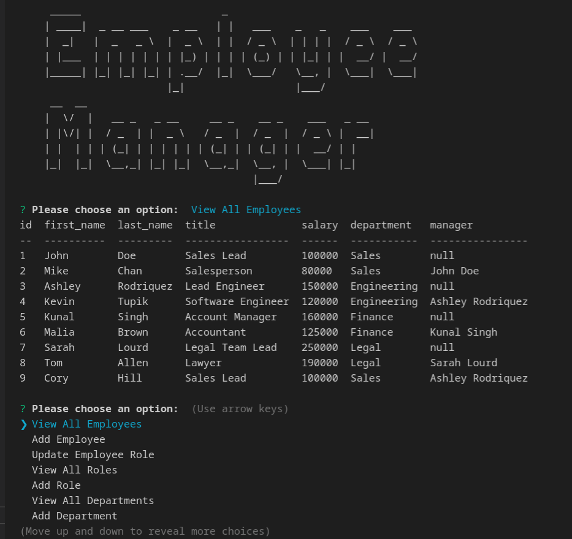

# Employee-Tracker

## Description

This is a Node.js/MySQL command-line application, that allows a user to view and manage departments, roles, and employees a company.

## Table of Contents

If your README is long, add a table of contents to make it easy for users to find what they need.

- [Installation](#installation)
- [Usage](#usage)
- [Demo](#demo)
- [Credits](#credits)
- [License](#license)
- [Badges](#badges)

## Installation

1. Download or clone repo
2. Install nodejs https://nodejs.org/en/download/
3. Run npm i in terminal while under the repo directory
4. Create a .env file in the root of this project folder and then add following to it:
    - DB_USERNAME = '[an admin username]'
    - DB_PASSWORD = '[that user's password]'
5. In the terminal login to msql while in project directory 
    - Run 'source db/schema.sql'
    - Run 'source db/seeds.sql'
    - Run 'exit'
    
## Usage

* Run `node index.js` to start application
* Use the following options:
    - `view all departments` -  formatted table showing department names and department ids
    - `view all roles` -  formatted table showing job title, role id, the department that role belongs to, and the salary for that role
    - `view all employees` - formatted table showing employee data, including employee ids, first names, last names, job titles, departments, salaries, and managers that the employees report to.
    - `add a department` - prompts the user to enter the name of the department they would like add to the database
    - `add a role` - enter the name, salary, and department for the role and that role is added to the database
    - `add an employee` - prompts the user to enter the employee’s first name, last name, role, and manager, and that employee is added to the database
    - `update an employee role` - prompts the user to select an employee to update and their new role. This information is then updated in the database 

## DEMO

[Demo](https://drive.google.com/file/d/13cD0w_8e1PJoThb2A5CgKlVkmxcJ1ITo/view?usp=sharing)

## Credits

* [Inquirer](https://www.npmjs.com/package/inquirer)
* [MySQL](https://www.mysql.com/)
* [Console Table](https://www.npmjs.com/package/console-table)
* [mysql2](https://www.npmjs.com/package/mysql2)
* [dotenv](https://www.npmjs.com/package/dotenv)

## License

## Badges

